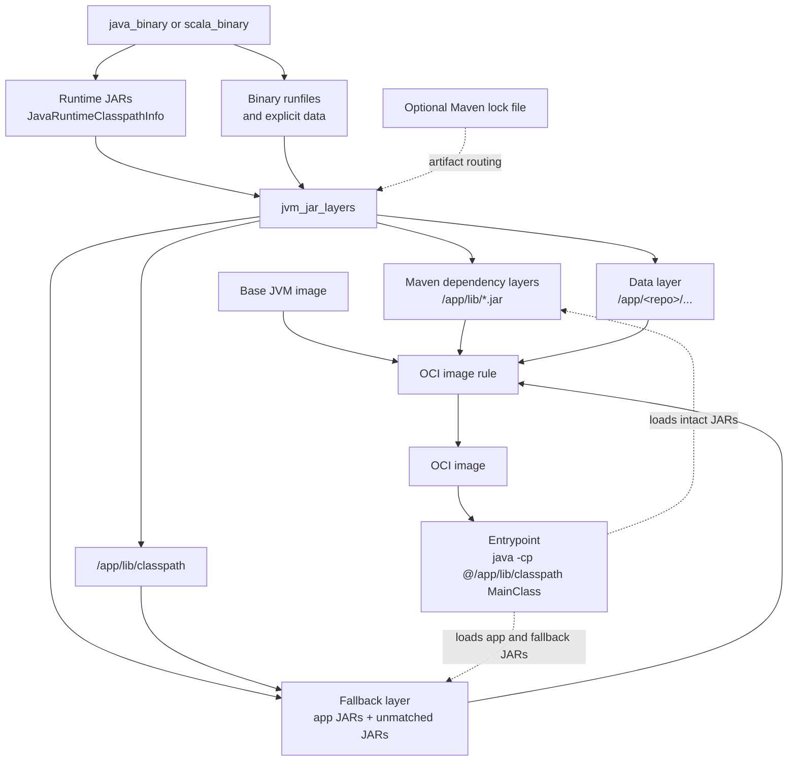

# jvm_image

[](https://github.com/stackb/jvm_image/actions/workflows/ci.yml)

`jvm_image` provides a Bazel rule that turns a `java_binary` or `scala_binary`
runtime into OCI-compatible tar layers. It is intended to be consumed by image
rules such as [`rules_img`](https://github.com/bazel-contrib/rules_img).

The public API is pre-1.0. Pin clients to a release tag or commit and review
upgrades before changing the pin.

`jvm_jar_layers` keeps every runtime JAR intact under `/app/lib`, preserving
duplicate resources and the normal JVM classpath model. Maven is not required:
without Maven metadata, the rule places the runtime classpath and its classpath
file in one fallback tar. With a `rules_jvm_external` lock file, Maven
dependencies can instead be placed in separate or grouped layers so
application-only changes retain the same dependency-layer digests for
registry- and fleet-wide cache reuse.

## How it fits together



## Install

Until the module is published to a registry, add a pinned override to the
client's `MODULE.bazel`:

```starlark
bazel_dep(name = "jvm_image", version = "0.1.0")

archive_override(
    module_name = "jvm_image",
    integrity = "sha256-FcnG0wSlMCAIGnLykKyQIshz8jauYHi8KEdDX5nNG+A=",
    strip_prefix = "jvm_image-0.1.0",
    urls = [
        "https://github.com/stackb/jvm_image/releases/download/v0.1.0/jvm_image-v0.1.0.tar.gz",
    ],
)
```

Do not point production clients at a moving branch.

## Usage

```starlark
load("@jvm_image//:jvm_jar_layers.bzl", "jvm_jar_layers")

jvm_jar_layers(
    name = "server_layers",
    binary = ":server",
    data = ["@fincad//:libraries"],
)
```

To partition recognized Maven dependencies into stable cacheable layers, pass
the lock file produced by a `rules_jvm_external` `maven.install` repository:

```starlark
jvm_jar_layers(
    name = "server_layers",
    binary = ":server",
    maven_lock_file = "//:maven_install.json",
    max_layers = 32,
)
```

Pass `:server_layers` to the image rule's layer/tar attribute. Configure the
image entrypoint with the binary's main class:

```starlark
entrypoint = [
    "java",
    "-cp",
    "@/app/lib/classpath",
    "com.example.Server",
]
env = {"JAVA_RUNFILES": "/app"}
```

The generated `classpath` file is included in the fallback tar. It is also
available through the target's `classpath` output group. The `binary` must
provide a non-empty JVM runtime classpath; analysis fails otherwise.

Non-JAR files in the binary's `data` runfiles are included automatically.
Additional `data` targets are collected explicitly and written to a dedicated
runfiles layer under `/app`. Workspace files use
`/app/<workspace>/<package>/<file>`; external files use
`/app/<canonical-repository>/<package>/<file>`. Set `JAVA_RUNFILES=/app` when
the application uses Bazel's runfiles lookup conventions. Host JDK files,
binary launchers, and runtime JARs are excluded from this data layer.

The `example/hello` oci_tarball has the following structure:

```
--- sha256:c4fd6f20ece135d1caf7d46368138b7aa58603e775f01c24479912075ec8c490 ---
Mode        Size  Name
-rw-r--r--  34 B  app/_main/greeting.txt
-rw-r--r--  36 B  app/_main/runtime/native.marker

--- sha256:19730c7f427ef030cf5b9eb1b610fc5d01855a9100e0ea08bdd5da06640fca7f ---
-rw-r--r--  1.2 kB  app/lib/hello.jar
-rw-r--r--  2.3 kB  app/lib/processed_listenablefuture-9999.0-empty-to-avoid-conflict-with-guava.jar
-rw-r--r--  364 B   app/lib/classpath

--- sha256:3abdf128e65e2e1437f3ac7346c0e9fabdf3f9842a99cbcbef42207181b64065 ---
-rw-r--r--  21 kB  app/lib/processed_jsr305-3.0.2.jar

--- sha256:1cbbdab98aee4c1ea5436f305f2cd68169443dfa4f0931becb4800d73371706f ---
-rw-r--r--  19 kB  app/lib/processed_error_prone_annotations-2.36.0.jar

--- sha256:58c28ed69316ce659037cb1df9c51533878a956c5e8bbe3bca7be9ef5bb428f7 ---
-rw-r--r--  4.8 kB  app/lib/processed_failureaccess-1.0.2.jar

--- sha256:a6ef98beaef5ab8b409ca6cec41b3d5be38804bcec418b3c3138cd470e5704e3 ---
-rw-r--r--  3.1 MB  app/lib/processed_guava-33.4.0-jre.jar

--- sha256:8d650354e3037e3908f78628d47b637d0ec1922988c5f24a75b2a15626502c8b ---
-rw-r--r--  12 kB  app/lib/processed_j2objc-annotations-3.0.0.jar

--- sha256:05fd8c687c7112da76548914db47d51d43f023ce2ac3cde4dc91c1a8aad92bd0 ---
-rw-r--r--  232 kB  app/lib/processed_checker-qual-3.43.0.jar
```

## Configuration notes

- `maven_lock_file` is optional. When omitted, every runtime JAR goes to the
  fallback tar.
- `data` is optional. It accepts files and targets and includes their transitive
  runfiles without adding them to the JVM classpath. Destination collisions
  fail the build instead of silently overwriting a file.
- `max_layers` limits Maven-derived tar layers. It excludes the fallback tar
  and has no effect without `maven_lock_file`. Set it to `0` to disable
  Maven-derived layers.
- `layer_strategy = "group_by_prefix"` groups Maven coordinates when their
  count exceeds `max_layers`; `"truncate"` sends the excess to the fallback.
- `path_prefix` is a relative archive prefix and must end in `/` when non-empty.
  `app_prefix` is the corresponding absolute path inside the image.
- Artifact routing uses the lock file's `packages` map. Unmatched or ambiguous
  package ownership goes to the fallback instead of selecting a layer based on
  map or ZIP iteration order.
- The intact-JAR classpath format targets Linux containers. Paths containing
  whitespace or `:` are rejected because `:` is the classpath separator.

## Validate locally

```sh
go test ./...
go vet ./...
staticcheck ./...
bazel test //...

cd example/hello
bazel build //:image
```

The example in [`example/hello`](example/hello) demonstrates `jvm_jar_layers`
with `rules_img`.

## Releasing

Before onboarding a client, pin a green commit, choose and add a repository
license, and publish a matching `v0.1.x` tag. A license is intentionally not
inferred by this repository. See [`RELEASING.md`](RELEASING.md) for the GitHub
release and Bazel Central Registry process.
